# VIGOR

A native iPhone strength-training app, a desktop **Program Builder**, and a **Coach Portal** for digging into a client's data on a laptop. Requires **iOS 17+**.

| Part | What it is |
|---|---|
| **iPhone app** | SwiftUI client in `WorkoutApp/` |
| **Program Builder** | Static site in `program-builder/` — [live site](https://program-builder-mu.vercel.app/) |
| **Coach Portal** | Static site in `portal/` — import an app export, explore it in depth [live site](https://vigor-workout-portal.vercel.app/) |

---

## Architecture

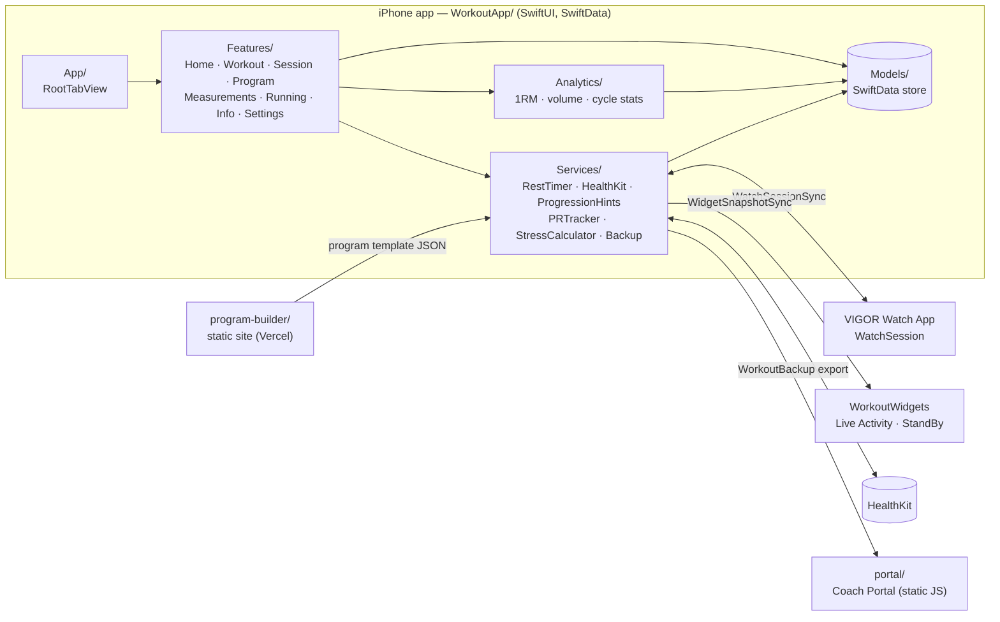

More detail: [docs/ARCHITECTURE.md](docs/ARCHITECTURE.md)

## The app

| Home | Logging | Programs |
|:---:|:---:|:---:|
| 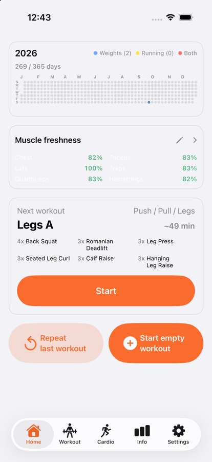 | 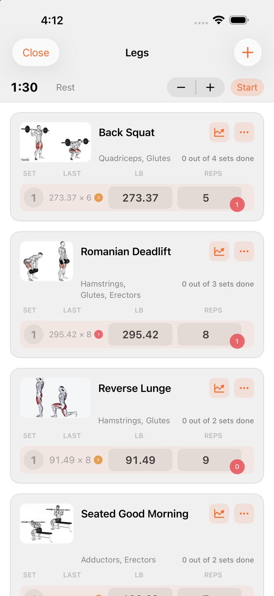 | 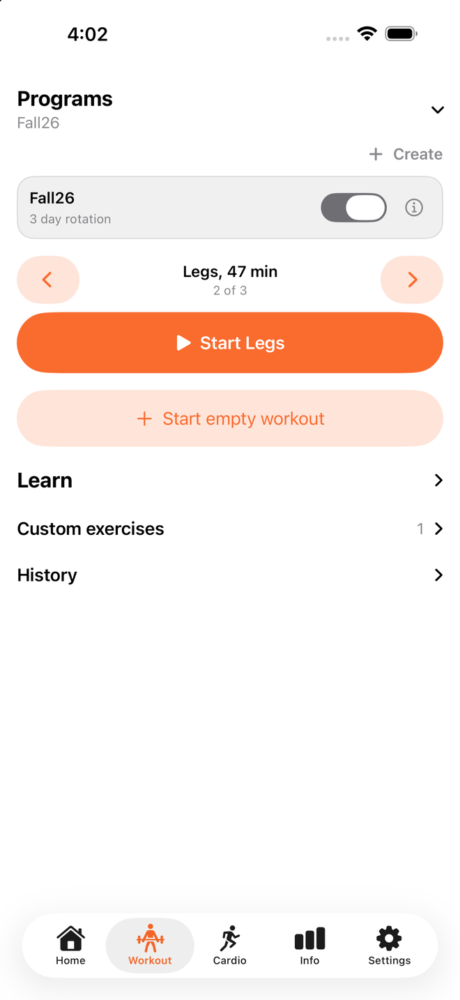 |

| Workout summary | Recovery | Exercise catalog |
|:---:|:---:|:---:|
| 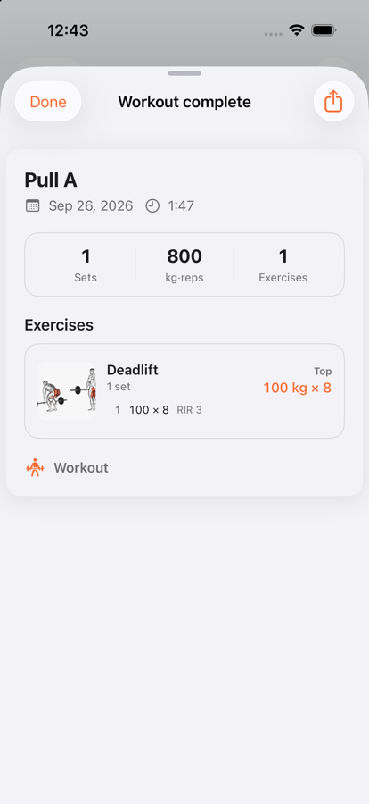 | 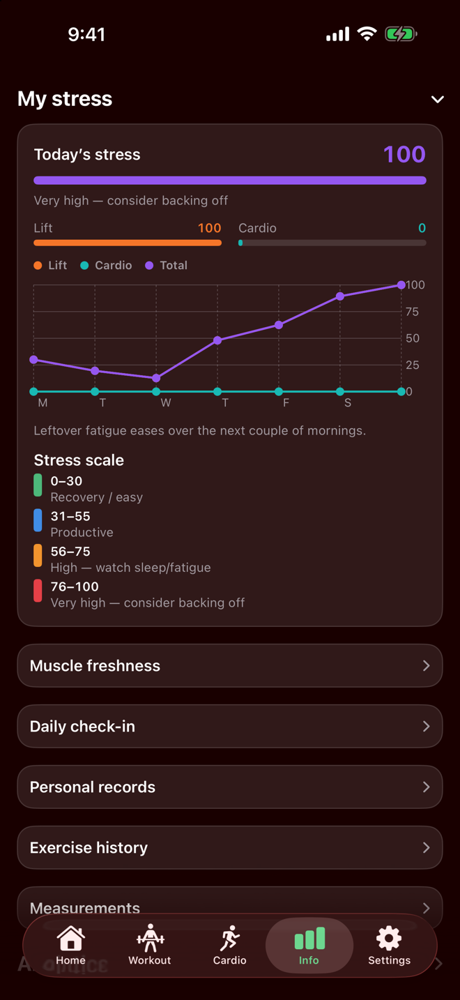 | 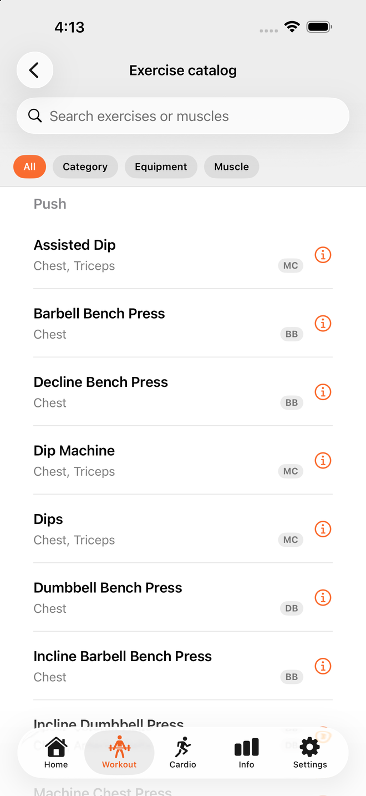 |

| Cardio | Customization |
|:---:|:---:|
| 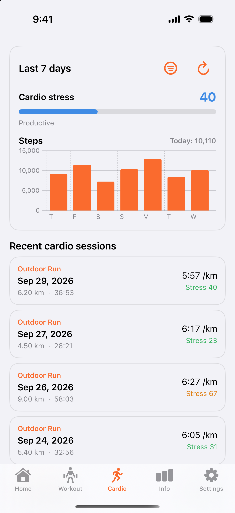 | 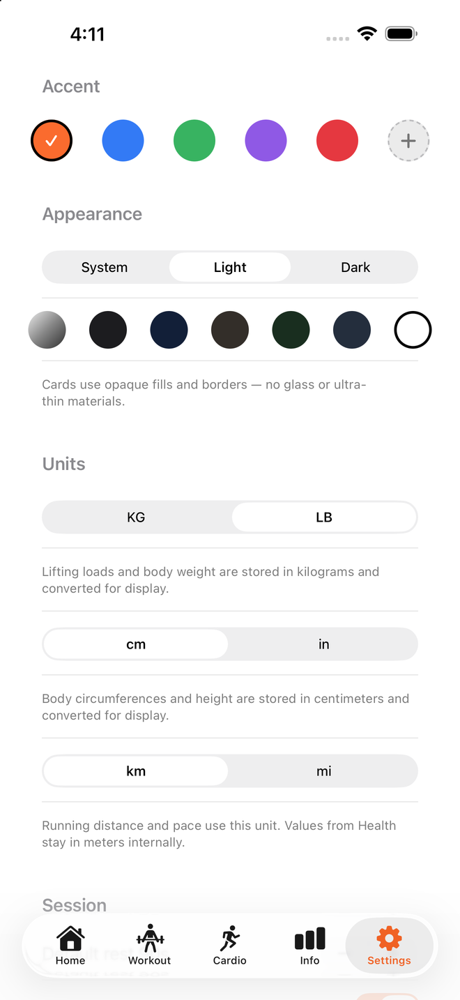 |

### Features

- **Logging:** custom keypad, RIR on every set, rest timer, plate calculator, estimated 1RM, editable sets
- **Programs:** multi-day rotating programs, planned vs logged sets, JSON import from the Program Builder
- **Recovery:** daily stress and 7-day trend, per-muscle freshness, volume and tonnage charts
- **Cardio:** runs, rides and walks from Apple Health with pace, heart-rate and route views
- **Home & widgets:** year activity grid, today's stress, next workout
- **Settings:** accent and background colors, light/dark, kg/lb, km/mi, body weight and measurements, Health sync
- **Export:** pick what to export (weight, workouts, cardio) and the period, as JSON for the Coach Portal

---

## Coach Portal

Import a client's export and get the full picture on a bigger screen: ten pages from volume and PRs to stress, balance and body composition. It picks up the client's app colors, has light and dark modes, handles multiple clients, and keeps everything in the browser (nothing is uploaded). **Try demo data** on the import page loads a sample client.

| Overview | Weightlifting | Cardio |
|:---:|:---:|:---:|
| 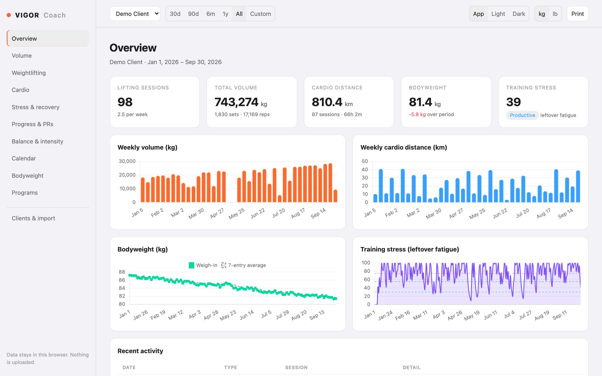 | 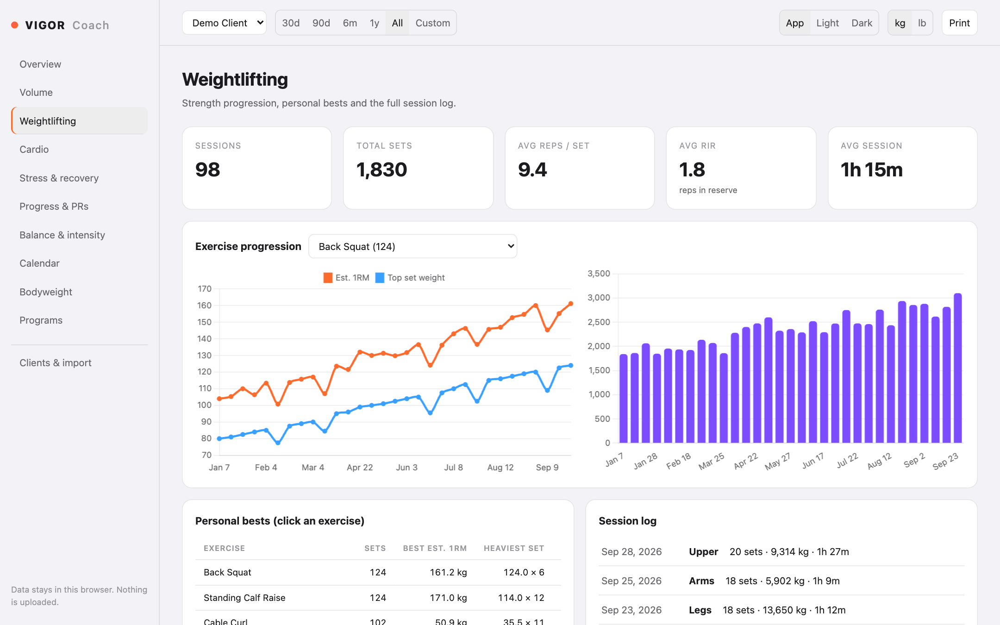 | 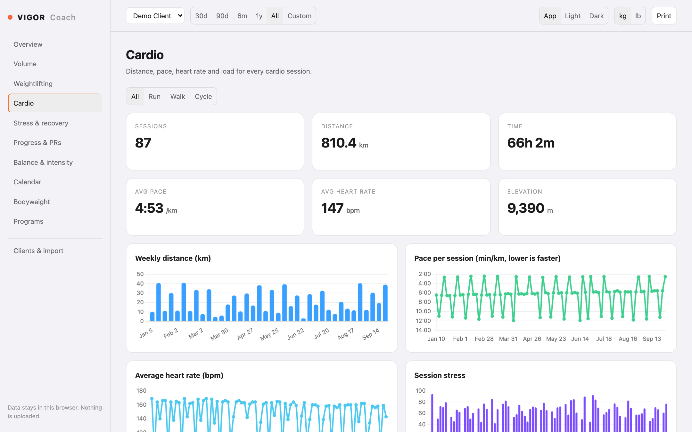 |

| Stress & recovery | Progress & PRs | Balance & intensity |
|:---:|:---:|:---:|
| 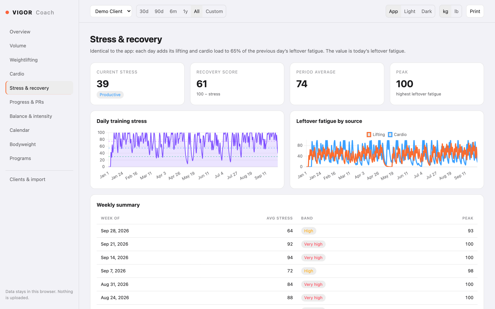 | 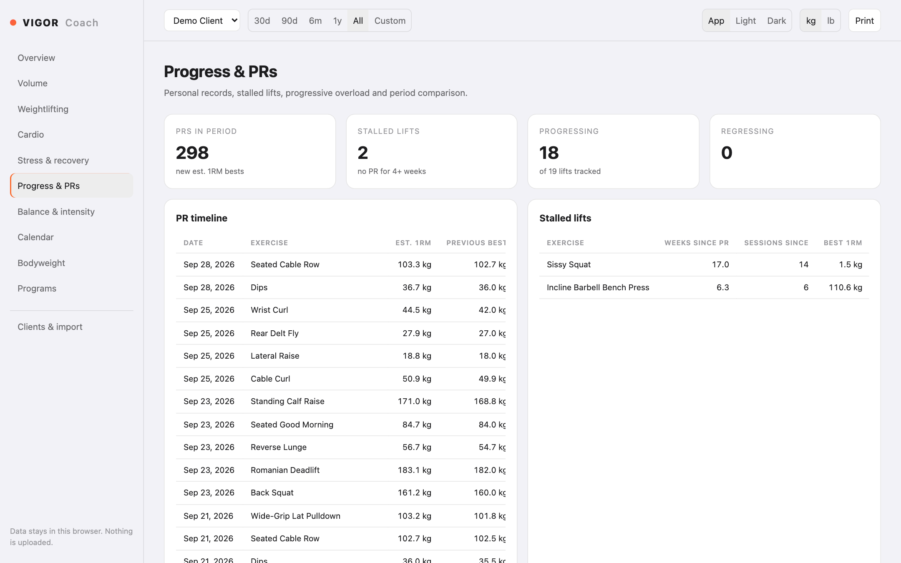 | 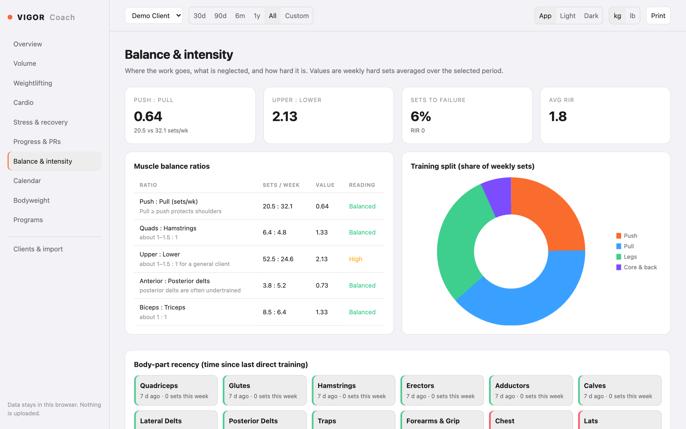 |

| Volume | Calendar | Bodyweight |
|:---:|:---:|:---:|
| 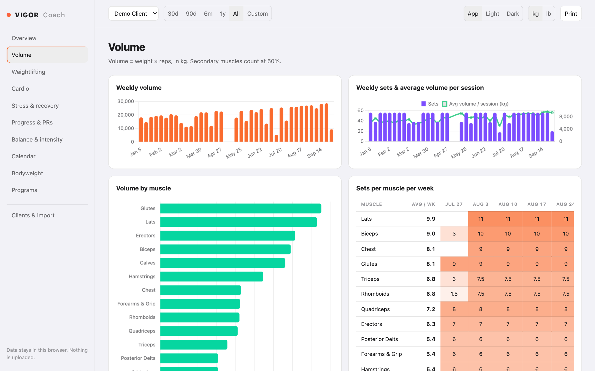 | 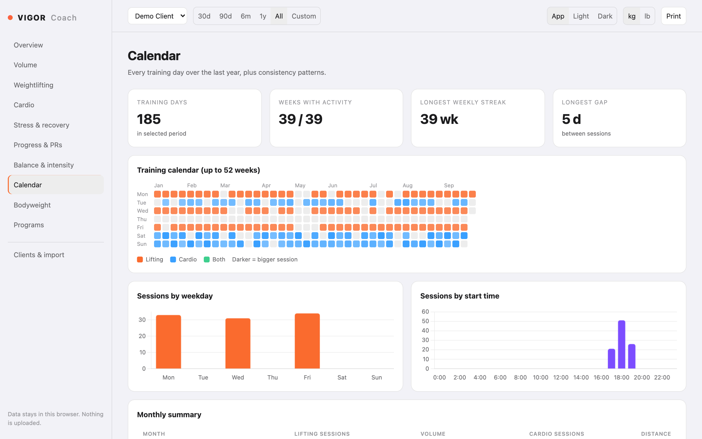 | 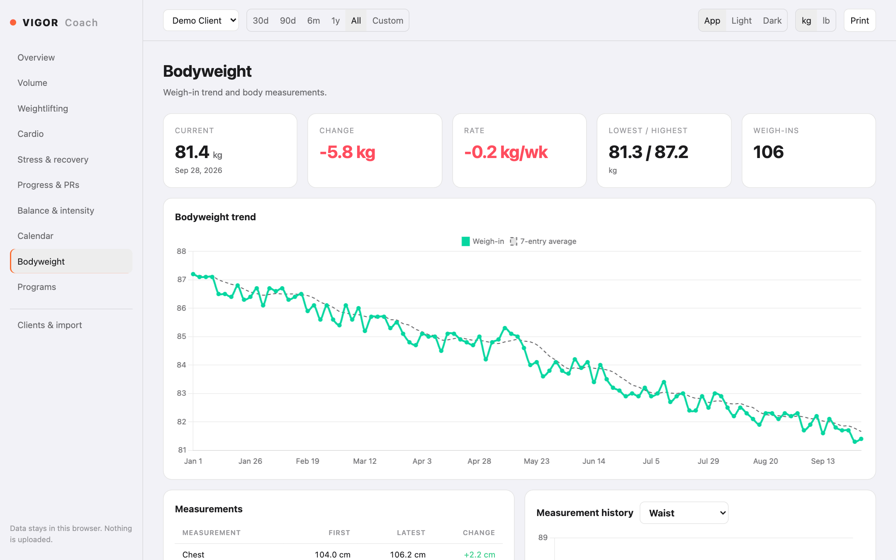 |

The stress model is the same one the app uses, so numbers match between phone and portal.

---

## Program Builder

Assemble rotating programs from the app's exercise catalog, see muscle balance across 20 muscles, and export JSON the app imports.

| Builder | Overview |
|:---:|:---:|
|  |  |

---

## Built with

SwiftUI · SwiftData · Swift Charts · MapKit · HealthKit · WidgetKit. Vanilla JS and Chart.js for the web parts.

Unit tests cover the analytics math, JSON round-trips and the iOS↔web program contract; CI runs them on every push.

Strength sessions stay on-device unless you turn on writing finished workouts to Apple Health. Cardio from Health is read-only.
