# VIGOR

A native iPhone strength-training app, a desktop **Program Builder**, and a **Coach Portal** for digging into a client's data on a laptop. Requires **iOS 17+**.

| Part | What it is | Link |
|---|---|---|
| **iPhone app** | SwiftUI client in `WorkoutApp/` | [Demo site: tour the features](https://vigor-workout-demo.vercel.app/) |
| **Program Builder** | Desktop static site in `program-builder/` | [Open the builder](https://program-builder-mu.vercel.app/) |
| **Coach Portal** | Static site in `portal/`: import an app export, explore it in depth | [Open the portal](https://vigor-workout-portal.vercel.app/#/overview) |

---

## Architecture

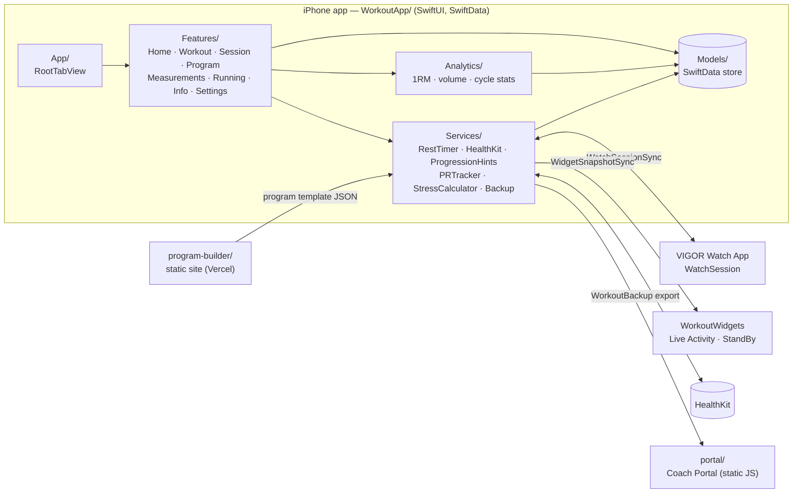
```mermaid
flowchart LR
    subgraph iOS["iPhone app — WorkoutApp/ (SwiftUI, SwiftData)"]
        App[App/<br/>RootTabView]
        Feat["Features/<br/>Home · Workout · Session · Program<br/>Measurements · Running · Info · Settings"]
        Ana[Analytics/<br/>1RM · volume · cycle stats]
        Svc["Services/<br/>RestTimer · HealthKit · ProgressionHints<br/>PRTracker · StressCalculator · Backup"]
        Models[(Models/<br/>SwiftData store)]
        App --> Feat
        Feat --> Ana
        Feat --> Svc
        Feat --> Models
        Ana --> Models
        Svc --> Models
    end

    Watch["VIGOR Watch App<br/>WatchSession"]
    Widgets["WorkoutWidgets<br/>Live Activity · StandBy"]
    HK[(HealthKit)]
    Builder["program-builder/<br/>static site (Vercel)"]
    Portal["portal/<br/>Coach Portal (static JS)"]

    Svc <-->|WatchSessionSync| Watch
    Svc -->|WidgetSnapshotSync| Widgets
    Svc <--> HK
    Builder -->|program template JSON| Svc
    Svc -->|WorkoutBackup export| Portal
```

More detail: [docs/ARCHITECTURE.md](docs/ARCHITECTURE.md)

## The app

**[Explore the demo site](https://vigor-workout-demo.vercel.app/)** to see the features without installing anything.

| Home | Logging | Programs |
|:---:|:---:|:---:|
| 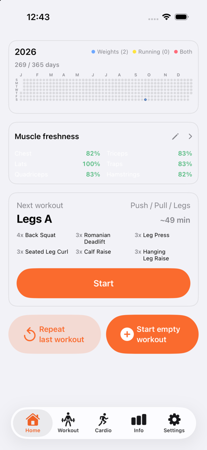 | 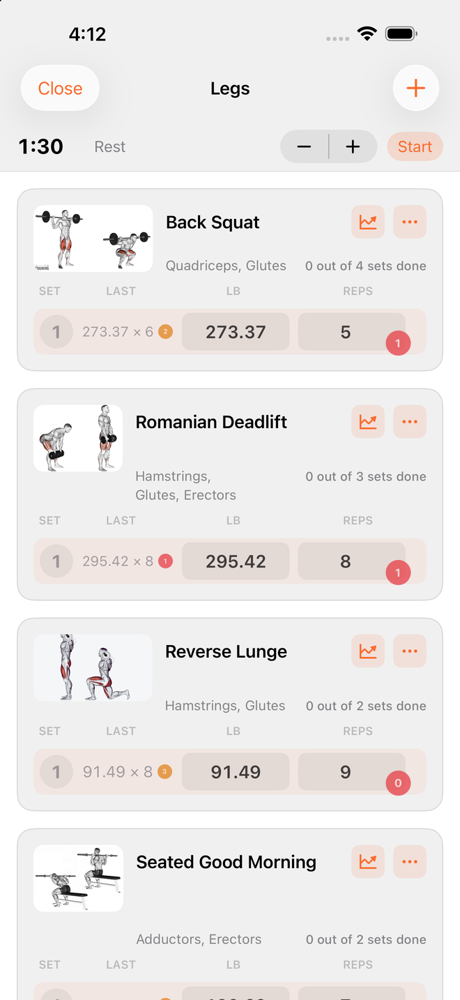 | 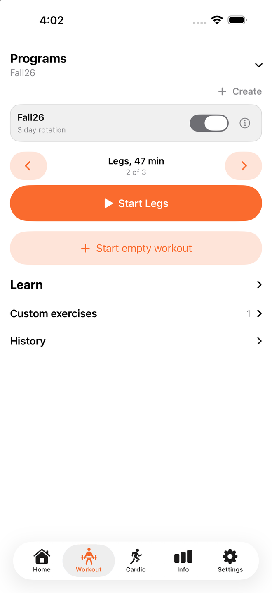 |

| Workout summary | Recovery | Exercise catalog |
|:---:|:---:|:---:|
| 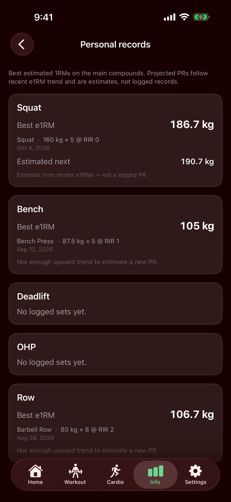 | 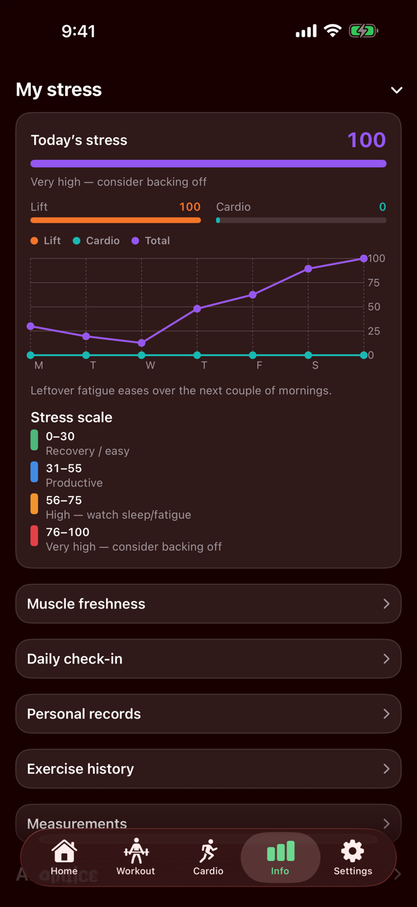 | 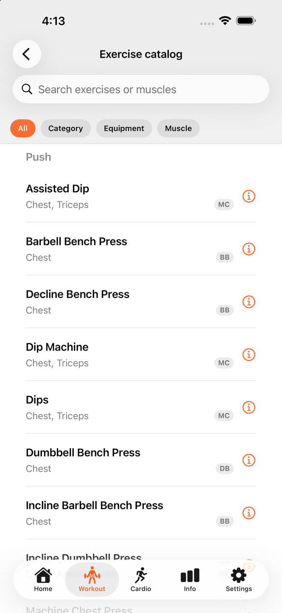 |

| Cardio | Customization |
|:---:|:---:|
| 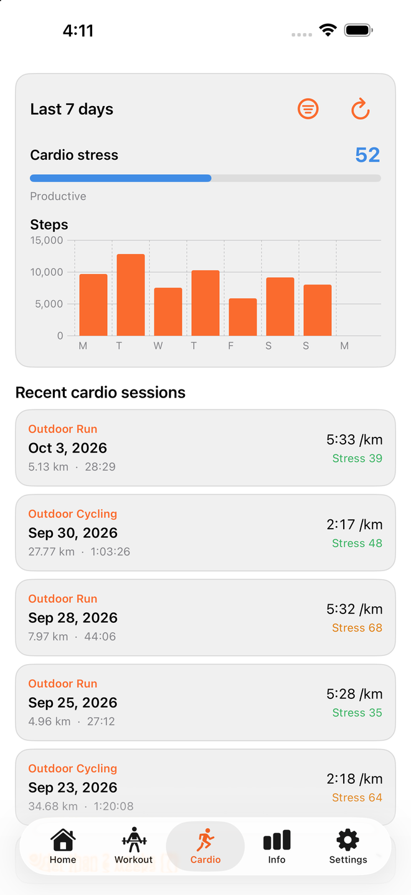 | 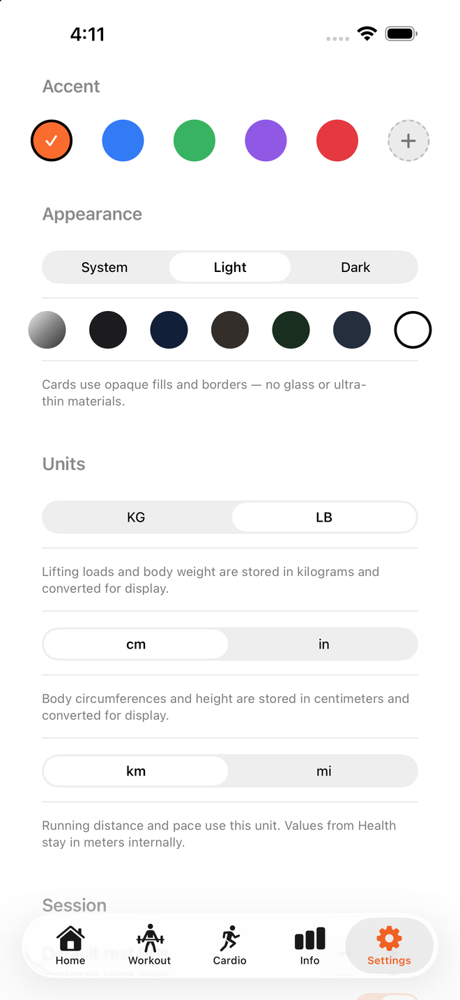 |

### Apple Watch

A companion app follows the workout you run on your phone: turn the Digital Crown to set weight, reps and RIR, tap to log, and watch the rest ring count down. Sets are pre-filled from your last session.

| Log a set | Rest timer | Finish |
|:---:|:---:|:---:|
| 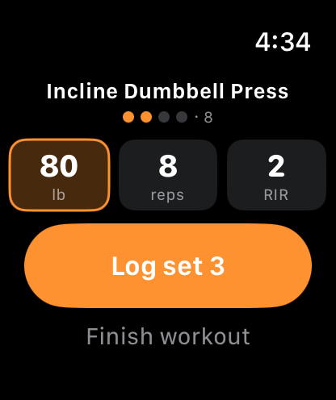 | 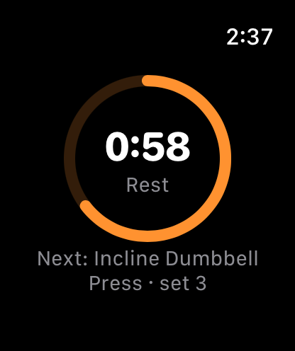 | 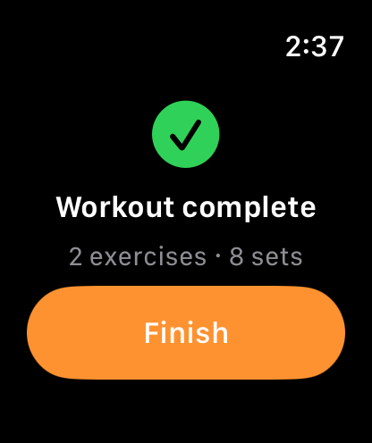 |

### Features

- **Logging:** custom keypad, RIR on every set, rest timer, plate calculator, estimated 1RM, editable sets, progression suggestions
- **Assisted lifts:** log the assistance on assisted pull-ups and dips; less assistance counts as harder for suggestions, PRs and volume
- **Exercise catalog:** 140+ exercises with photos, cues and muscles, searchable and filterable by category, equipment and muscle
- **PRs:** celebration on a new estimated-1RM record, with personal-record history
- **Bar speed (VBT):** track bar velocity from the camera during a set
- **Programs:** multi-day rotating programs, planned vs logged sets, JSON import from the Program Builder
- **Recovery:** daily stress and 7-day trend, per-muscle freshness, volume and tonnage charts, deload advice and a train-today suggestion
- **Daily check-in:** sleep, mood and energy with an optional reminder, plus insights from Apple Health on what affects how you feel
- **Cardio:** runs, rides, hikes and more from Apple Health with pace, heart-rate and route views
- **Home & widgets:** year activity grid (lifting and cardio), today's stress, next workout, plus StandBy and Lock Screen widgets
- **Settings:** accent and background colors, light/dark, kg/lb, km/mi, body weight and measurements, Health sync
- **Export:** pick what to export (weight, workouts, cardio) and the period, as JSON for the Coach Portal

---

## Coach Portal

**[Open the live portal](https://vigor-workout-portal.vercel.app/#/overview)**

Import a client's export and get the full picture on a bigger screen: ten pages from volume and PRs to stress, balance and body composition. It picks up the client's app colors, has light and dark modes, handles multiple clients, and keeps everything in the browser (nothing is uploaded). **Try demo data** on the import page loads a sample client.

| Overview | Weightlifting | Cardio |
|:---:|:---:|:---:|
| 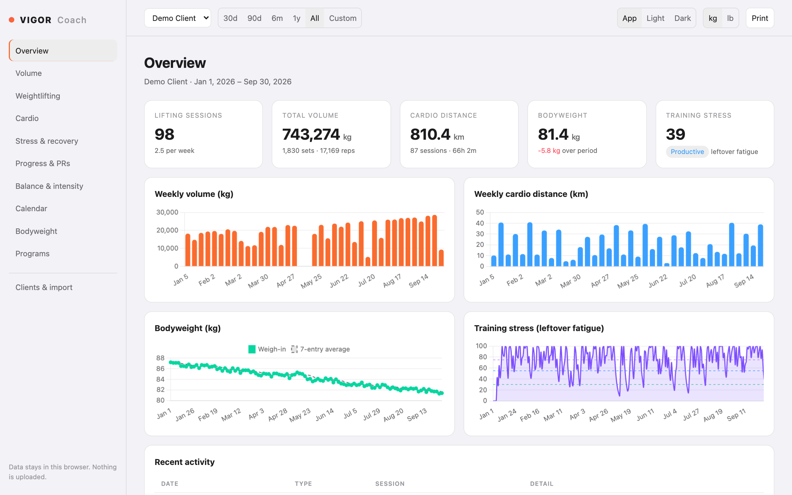 | 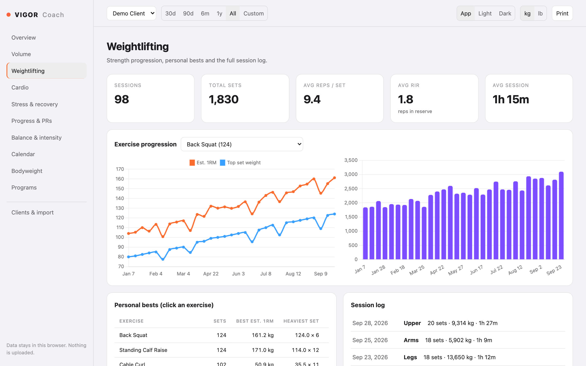 | 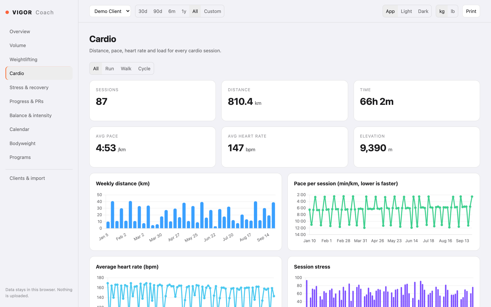 |

| Stress & recovery | Progress & PRs | Balance & intensity |
|:---:|:---:|:---:|
| 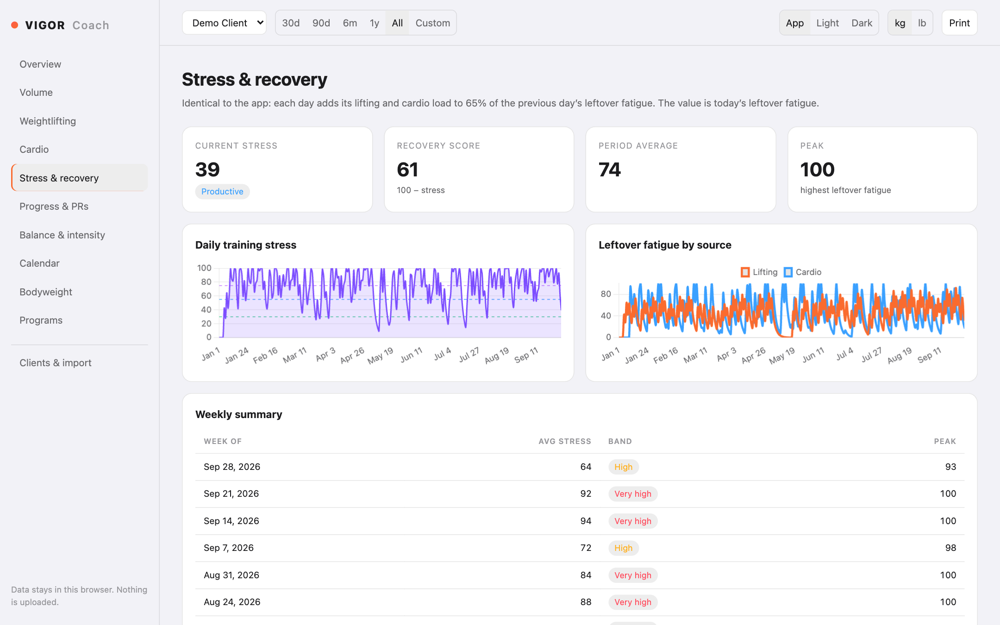 | 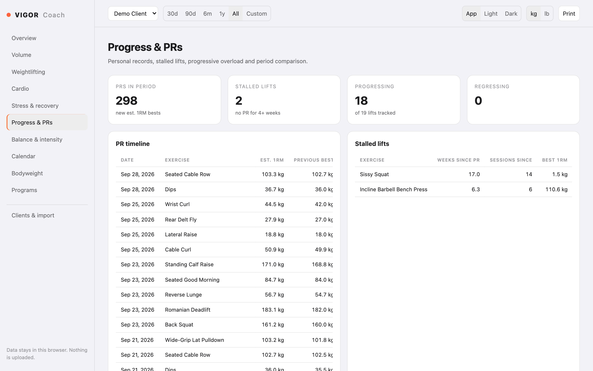 | 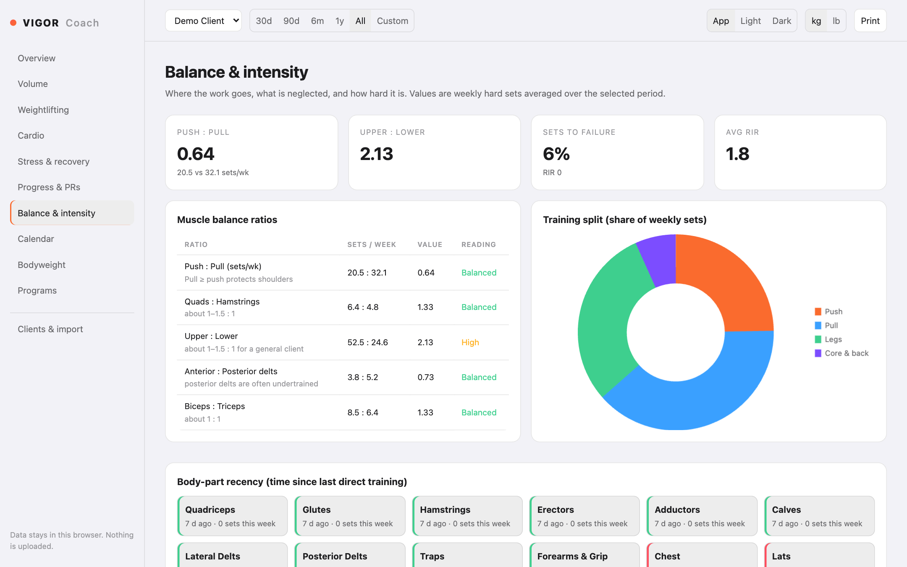 |

| Volume | Calendar | Bodyweight |
|:---:|:---:|:---:|
| 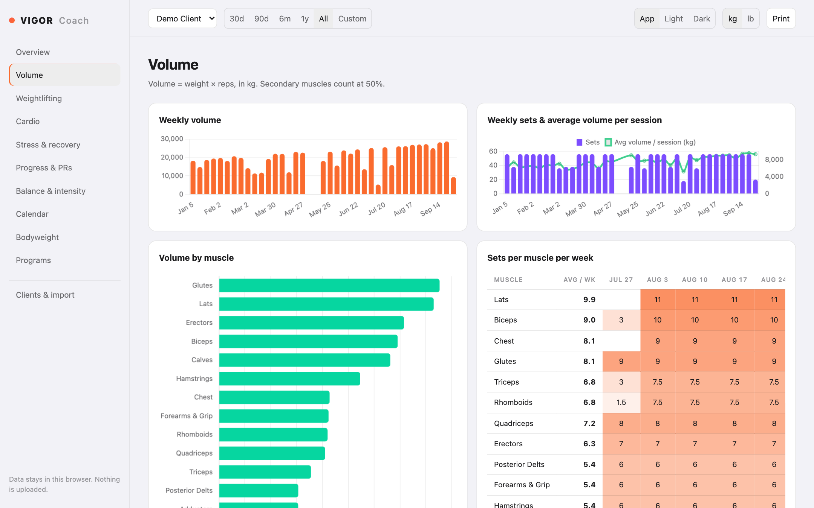 | 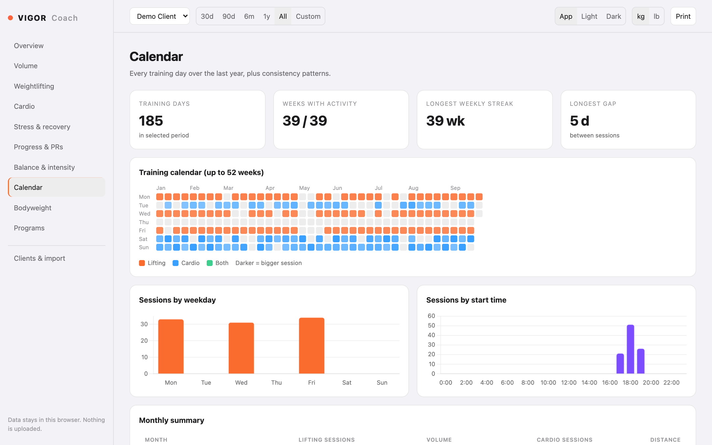 | 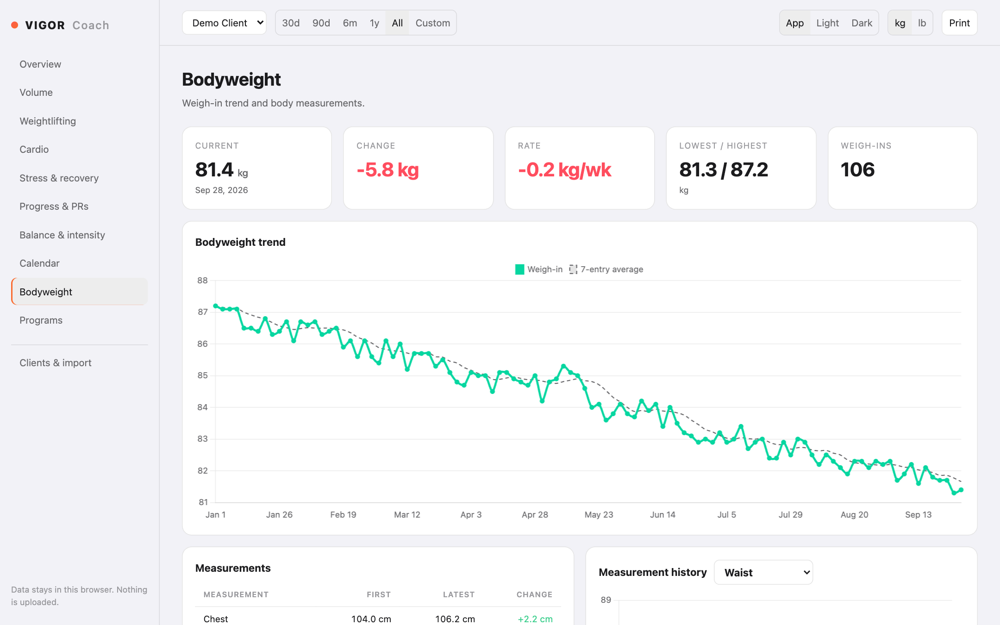 |

The stress model is the same one the app uses, so numbers match between phone and portal.

---

## Program Builder

**[Open the live builder](https://program-builder-mu.vercel.app/)** (best on desktop)

Assemble rotating programs from the app's exercise catalog, see muscle balance across 20 muscles, and export JSON the app imports.

| Builder | Overview |
|:---:|:---:|
|  |  |

---

## Path and purpose

| Path | Purpose |
|---|---|
| `WorkoutApp/App/` | App entry and `RootTabView` |
| `WorkoutApp/Features/` | Screens by area: Home, Workout, Session, Program, Measurements, Running, CheckIn, VBT (bar speed), ActivityDetail, Info, Settings |
| `WorkoutApp/Analytics/` | Pure analytics: estimated 1RM, volume, PR detection, deload and train-today advisors, program cycle stats, check-in insights |
| `WorkoutApp/Services/` | Rest timer, HealthKit, progression hints, stress calculator, PR tracker, Watch and widget sync, backup/export, program template import |
| `WorkoutApp/Models/` | SwiftData models and the exercise catalog |
| `WorkoutApp/Shared/` | Plate calculator, formatters, shared UI, and the widget snapshot / rest-timer attributes shared with extensions |
| `WorkoutApp/Theme/` | Accent and appearance theming |
| `VIGOR Watch App Watch App/` | watchOS companion: logging UI and `WatchSession` |
| `WorkoutWidgets/` | Rest-timer Live Activity, StandBy and Lock Screen widgets |
| `WorkoutAppTests/`, `WorkoutAppUITests/` | Unit tests (analytics, JSON round-trips, contract, SwiftData) and UI tests |
| `contract/` | JSON schema and fixture for the iOS ↔ Program Builder program template |
| `program-builder/` | Desktop static site that builds programs and exports template JSON |
| `portal/` | Coach Portal: static JS site that analyzes an exported client file |
| `website/` | Marketing/demo site with the app screenshots |
| `docs/` | `ARCHITECTURE.md` and screenshots |
| `project.yml` | XcodeGen spec |

## Design patterns

- **Pure analytics layer.** 1RM, volume, PRs and advisors are functions over plain values, so they are unit-tested without UI or
  a database, and the same stress model is reimplemented for the portal so numbers match.
- **Schema-defined contract.** Programs move between the builder and the app through `contract/program-template.schema.json`,
  and a fixture test keeps both sides honest.
- **Snapshot for extensions.** Widgets and the Watch receive small snapshots (`WidgetSnapshot`, `WatchSessionSync`), not the
  SwiftData store.
- **SwiftData as single source of truth** on the phone; the Watch does not keep a second copy.
- **Services as seams to the system.** HealthKit, rest timer, reminders and backup sit behind service types the features call.
- **Static, build-free web tools.** The builder and portal are vanilla JS with Chart.js and run from any static host.
- **Local-first privacy.** Sessions stay on device unless the user turns on writing workouts to Apple Health.

## Built with

SwiftUI · SwiftData · Swift Charts · MapKit · HealthKit · WidgetKit. Vanilla JS and Chart.js for the web parts.

Unit tests cover the analytics math, JSON round-trips and the iOS↔web program contract; CI runs them on every push.

Strength sessions stay on-device unless you turn on writing finished workouts to Apple Health. Cardio from Health is read-only.
