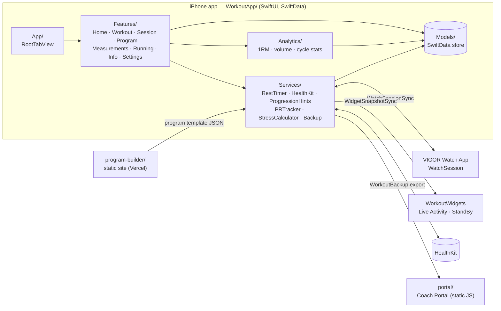

# Architecture

Three parts: a native iOS app (with Watch app and widgets), a static **Program Builder**, and a static **Coach Portal**.

| Path | Purpose |
|---|---|
| `WorkoutApp/` | iOS client (iOS 17+) |
| `VIGOR Watch App Watch App/` | watchOS companion |
| `WorkoutWidgets/` | Widgets and rest-timer Live Activity |
| `program-builder/` | Desktop program authoring (contract-tested against the app's template format) |
| `portal/` | Import an app export and explore it on a laptop |
